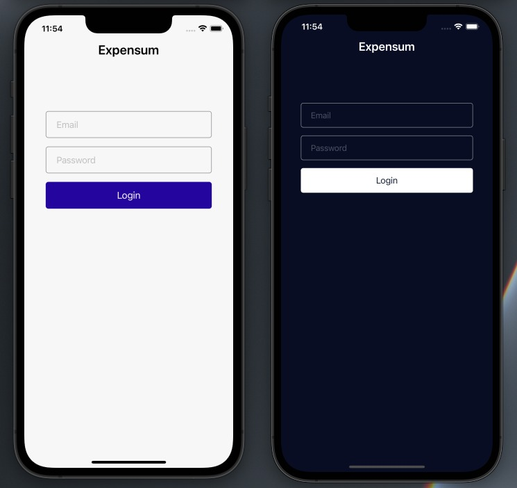
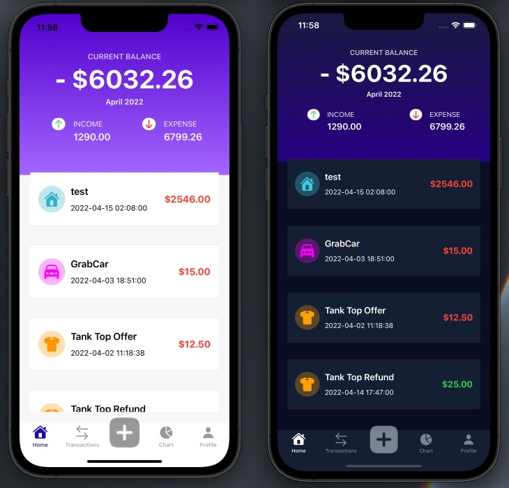
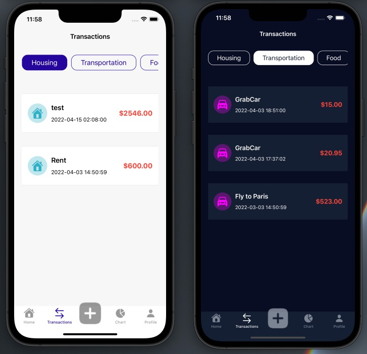
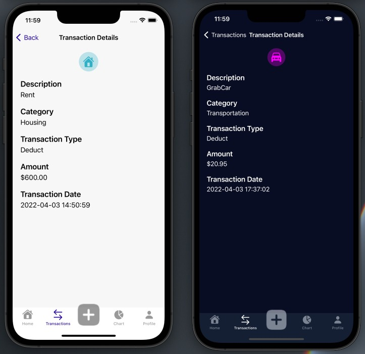
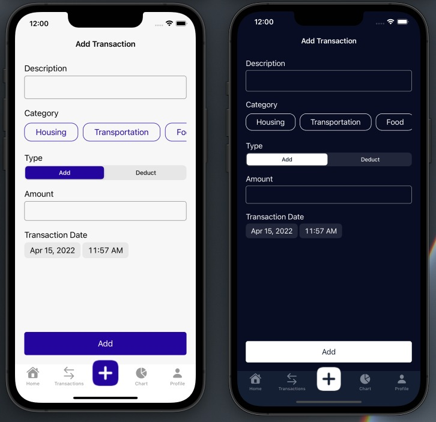

# Expensum
Expensum is an expense tracking project that I am working on to further improve my knowledge in Swift development and UIKit framework.
The UIs and subviews are developed programmatically rather than using Storyboards.
The project uses REST APIs from [Expensum Node](https://github.com/chrisjalf/expensum_node) for login, fetching data, and submitting data.

# Screenshots

